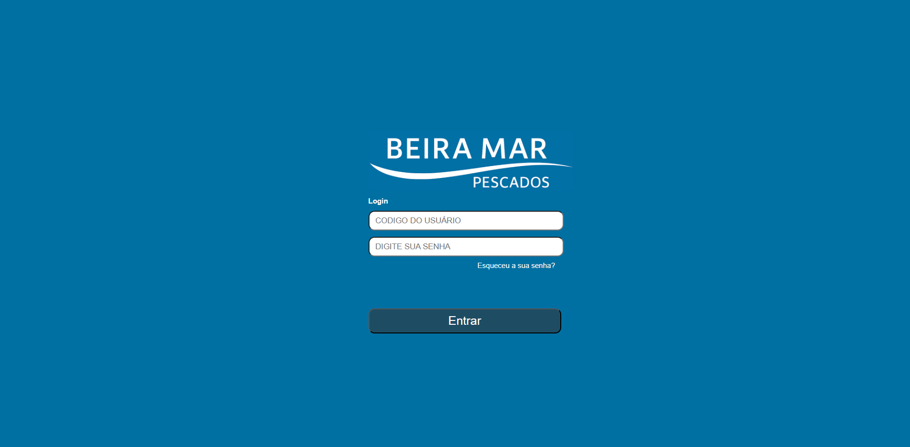
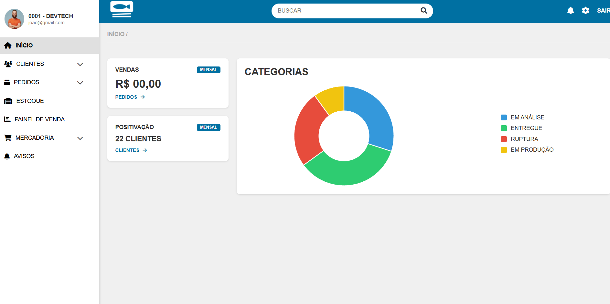

# Pescados Beira Mar  
Sistema Administrativo — Projeto em Desenvolvimento

Projeto desenvolvido para a disciplina **Residência em Software I**, da **Universidade Tiradentes (UNIT)**, com foco na criação de uma solução digital para organização e modernização dos processos internos da empresa Pescados Beira Mar.

🔗 Site do projeto:  
https://kauaemerencio.github.io/beiramarpescados/

---

## Sobre a Empresa

A **Pescados Beira Mar** é uma empresa sergipana fundada em **1974**, com atuação nos segmentos de atacado, varejo, restaurantes e feiras livres. Ao longo de sua trajetória, consolidou-se como uma referência regional no comércio e distribuição de pescados.

---

## Contexto do Projeto

Este projeto foi desenvolvido no contexto acadêmico da disciplina **Residência em Software I**, simulando um ambiente real de desenvolvimento de software.

O trabalho foi realizado de forma colaborativa pelo **Squad 3**, aplicando práticas de organização, divisão de tarefas e construção conjunta da solução.

---

## Objetivo

O objetivo do projeto é representar uma **plataforma administrativa integrada**, capaz de centralizar informações e organizar processos internos, proporcionando maior clareza, controle e eficiência operacional.

---

## Desenvolvimento

O desenvolvimento do projeto seguiu uma abordagem prática e incremental, passando pelas seguintes etapas:

- Análise do funcionamento da empresa  
- Identificação dos principais desafios operacionais  
- Definição do fluxo principal do sistema  
- Prototipação das telas no Figma  
- Desenvolvimento do site de apresentação  
- Publicação do projeto via GitHub Pages  

A proposta foi criar uma solução **simples, intuitiva e visualmente organizada**, servindo como base para evoluções futuras.

---

## Status do Projeto

**Status atual:** Em desenvolvimento (MVP)

Atualmente, o projeto conta com:
- Estrutura visual definida  
- Telas principais do sistema  
- Fluxo geral de navegação  
- Site publicado para visualização  

---

## Tecnologias Utilizadas

- HTML5  
- CSS3  
- JavaScript  
- Figma  
- Git e GitHub  
- GitHub Pages  

---

## Imagens do Projeto

> Substitua os nomes dos arquivos conforme as imagens do seu repositório.

### Tela Inicial


### Visão Geral do Sistema


### Fluxo de Pedido


---

## Estrutura do Projeto

```bash
beiramarpescados
├── assets
│   └── imagens do projeto
├── index.html
├── style.css
├── script.js
└── README.md
Desenvolvedores
Projeto desenvolvido em grupo (Squad 3) para a disciplina Residência em Software I — UNIT.

Kauã Lisboa Emerencio
Juntamente com os
Integrantes do Squad 3

Observações
Este é um projeto de caráter acadêmico, desenvolvido com foco em boas práticas de organização, design de interfaces e desenvolvimento frontend.

---
- ✔️ Limpa e profissional  
- ✔️ Linguagem madura  
- ✔️ Organização clara  
- ✔️ Sem exageros visuais  
- ✔️ Ótima para GitHub e avaliação  
